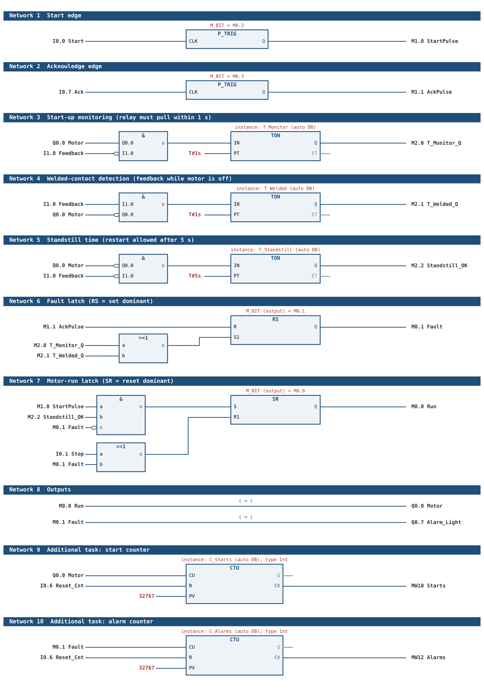

# Lab 2 – Motor Control, Fan: Step-by-Step Guide

Siemens S7-1214C · TIA Portal V16 · Course: Basics of Automation Technology

---

## 0. Goal in One Paragraph

A relay (coil on output **Q0.0**) switches the motor. The relay's auxiliary contact is fed back to input **I1.0**. The program (**FC1**, called from **OB1**) starts the motor on a rising edge of Start, stops it on Stop, supervises the relay feedback (1 s start-up monitoring + welded-contact detection), latches an alarm that must be acknowledged, and blocks a restart until the motor has been at standstill for 5 s. Additional task: counters for motor starts and alarms.

> ⚠️ **Document inconsistency:** The task text (page 5) says acknowledgement = **I0.6**. Annex 1 says acknowledgement = **I0.7** and counter reset = **I0.6**. This guide follows **Annex 1** (Ack = I0.7, Reset = I0.6). Verify at the station and ask the instructor if unsure.

---

## 1. I/O Table (Annex 1)

| Address | Symbol (suggested) | Meaning |
|---|---|---|
| I0.0 | `Start` | Start switch (leftmost), **rising edge** |
| I0.1 | `Stop` | Stop switch |
| I0.7 | `Ack` | Alarm acknowledge, **rising edge** |
| I0.6 | `Reset_Cnt` | Counter reset (additional task) |
| I1.0 | `Feedback` | Relay contact feedback |
| Q0.0 | `Motor` | Relay coil → motor |
| Q0.7 | `Alarm_Light` | Error light |

Hardware facts (CPU 1214C: 14 DI, 10 DO):
- I0.0–I0.7 = first input group (DI a), **I1.0 = first input of the second group (DI b)**.
- Q0.0–Q0.7 = DQ a, Q0.7 is the last output of that group.
- Outputs are 24 V DC (DC/DC/DC CPU) → the relay coil is driven directly with 24 V.

Additional tags to create (PLC tag table):

| Tag | Address | Type | Purpose |
|---|---|---|---|
| `M_Run` | M0.0 | Bool | Motor-run latch |
| `M_Fault` | M0.1 | Bool | Fault latch |
| `M_StartPrev` | M0.2 | Bool | Edge memory Start (P_TRIG M_BIT) |
| `M_AckPrev` | M0.3 | Bool | Edge memory Ack (P_TRIG M_BIT) |
| `StartPulse` | M1.0 | Bool | One-scan pulse on Start↑ |
| `AckPulse` | M1.1 | Bool | One-scan pulse on Ack↑ |
| `T_Monitor_Q` | M2.0 | Bool | 1 s start-up monitoring elapsed |
| `T_Welded_Q` | M2.1 | Bool | Welded-contact timer elapsed |
| `Standstill_OK` | M2.2 | Bool | 5 s standstill elapsed |
| `Starts` | MW10 | Int | Start counter value |
| `Alarms` | MW12 | Int | Alarm counter value |

---

## 2. Safety Rules (do first)

1. Only **24 V DC** connections. Never touch 230/400 V.
2. Keep the **logic power plug out of the socket** while wiring.
3. Keep clear of the rotating motor/fan.
4. **Show your wiring to the instructor before powering the PLC.**

---

## 3. Step-by-Step

### Step 1 – Create the project and add the CPU
1. Open **TIA Portal V16** → *Create new project* (e.g. `Lab2_MotorControl`).
2. *Add new device* → Controllers → SIMATIC S7-1200 → CPU 1214C → pick the **exact order number** printed in small print on the CPU (the figure in the handout shows `6ES7 214-1AG40-0XB0`, i.e. DC/DC/DC, but check the real device and its firmware version). Ask the instructor if unsure.
3. In *Device configuration* → CPU properties → *DI 14/DQ 10*: confirm the I/O start addresses are **0** (inputs I0.x / I1.x, outputs Q0.x / Q1.x).
4. Set the CPU's IP address in the same subnet as your PG/PC (needed for download in Step 6).

### Step 2 – Inspect the supply wiring (logic plug still out!)
Find out, without changing anything:
- How the supply above the CPU is branched to the terminal blocks on the pedestal.
- Which terminals carry **+24 V DC** and which carry **0 V**.
- Whether the CPU's supply (L+/M), the input sensor supply and the output supply (**3L+ / 3M**) are already connected (see Figure 2 and Annex 2).

Write the terminal numbers down – they go into your report.

### Step 3 – Wire the field side (logic plug still out!)
Connect **only** between the pedestal terminal blocks and the field (relay/motor). Use Annex 2 and the principle diagrams on the back of the PLC cover.

| From | To | Note |
|---|---|---|
| Terminal for **Q0.0** | Relay coil **A1(+)** (relay pin 2) | coil + |
| Relay coil **A2** (relay pin 10) | **0 V** | coil − |
| +24 V | Relay contact **common** (e.g. 11 / base pin 1) | contact set 1 |
| Relay contact **NO** (14 / base pin 3) | Motor + | motor path |
| Motor − | 0 V | |
| +24 V | Second contact common (e.g. 21 / base pin 6) | contact set 2 = feedback |
| Second contact **NO** (24 / base pin 7) | Terminal for **I1.0** | feedback to PLC |
| +24 V → Start / Stop / Ack / Reset switches → terminals for I0.0 / I0.1 / I0.7 / I0.6 | | switches are already on the board (Start = leftmost) |

Notes:
- The relay and its base use **different numbering** (Figure 3: relay 11/12/14, 21/22/24, 31/32/34, A1/A2 vs. base 1…11, 2, 10). The mapping above is my reading of the figure – **compare with Figure 3 and Annex 2 before wiring**.
- Alarm light on Q0.7 (use the connected lamp on the board or leave it open / use LED indicator on the CPU).
- Use the **NO** contact for the feedback (closed = relay pulled).

**Checkpoint:** Show the wiring to the instructor. Only after approval continue.

### Step 4 – Create the PLC tags
*PLC tags* → default tag table: enter all tags from Section 1 (I/O and M-bits) with the exact addresses and types. Compile.

### Step 5 – Program FC1 and OB1
1. *Add new block* → **Function (FC)** → name `MotorControl`, number **1**, language **FBD** (function block diagram).
2. In **OB1 (Main)** (also FBD or LAD) call `FC1` once (drag FC1 into Network 1). No parameters needed.
3. Build the **10 networks** of FC1 exactly as in the sketch `Lab2_FBD_Sketch.png` (same folder) and in 5.2 below.

#### 5.1 Logic (what the program must do)

**a) Edge detection (cycle-safe)**
- `StartPulse` = I0.0 is 1 now and was 0 in the last scan.
- `AckPulse` = I0.7 is 1 now and was 0 in the last scan.

**b) Supervision timers**

| Timer | IN condition | PT | Meaning |
|---|---|---|---|
| `T_Monitor` | `Motor` AND NOT `Feedback` | 1 s | commanded on but relay did not pull → **fault** |
| `T_Welded` | `Feedback` AND NOT `Motor` | 1 s | feedback present though motor is off → **welded contact fault** (1 s gives the relay time to drop out normally) |
| `T_Standstill` | NOT `Motor` AND NOT `Feedback` | 5 s | motor really at standstill → restart allowed |

**c) Fault latch (`M_Fault`)**
- **Set** when `T_Monitor.Q` OR `T_Welded.Q`.
- **Reset** by `AckPulse` (only effective if the cause is gone – otherwise the timer sets it again at once).
- `Alarm_Light` = `M_Fault`.

**d) Run latch (`M_Run`)**
- **Set** when `StartPulse` AND `T_Standstill.Q` AND NOT `M_Fault`.
- **Reset** (dominant) when `Stop` OR `M_Fault`.
- `Motor` (Q0.0) = `M_Run`.

**e) Additional task**
- The start counter (MW10) counts rising edges of `Motor`; the alarm counter (MW12) counts rising edges of `M_Fault`.
- Both reset by `Reset_Cnt` (I0.6).

State summary:

```
IDLE (standstill ≥5 s, no fault) --Start↑--> STARTING (Q0.0=1, 1 s timer)
STARTING --Feedback within 1 s--> RUNNING
STARTING --no feedback after 1 s--> FAULT (Q0.0=0, Q0.7=1)
RUNNING  --Stop-->  STOPPED (wait 5 s standstill) --> IDLE
ANY (motor off) --Feedback=1 for 1 s--> FAULT (welded contact)
FAULT --Ack↑ (cause gone)--> STOPPED/IDLE
```

#### 5.2 FBD networks for FC1 (rebuild 1:1 – see `Lab2_FBD_Sketch.png`)



Drag the boxes from the *Instructions* task card: *Basic instructions → Bit logic* (`&`, `>=1`, `RS`, `SR`, `P_TRIG`, assign `=`), *Timer operations* (`TON`), *Counter operations* (`CTU`). Right-click an input of `&` / `>=1` → *Insert input* for a third input, and right-click an input pin → *Invert RLO* for the negation circle.

| Net | Boxes | Inputs | Output |
|---|---|---|---|
| 1 | `P_TRIG` (M_BIT = M0.2) | CLK ← I0.0 | Q → M1.0 `StartPulse` |
| 2 | `P_TRIG` (M_BIT = M0.3) | CLK ← I0.7 | Q → M1.1 `AckPulse` |
| 3 | `&` → `TON` | `&`: Q0.0, **NOT** I1.0 → IN; PT = `T#1s` | Q → M2.0 |
| 4 | `&` → `TON` | `&`: I1.0, **NOT** Q0.0 → IN; PT = `T#1s` | Q → M2.1 |
| 5 | `&` → `TON` | `&`: **NOT** Q0.0, **NOT** I1.0 → IN; PT = `T#5s` | Q → M2.2 |
| 6 | `>=1` → `RS` | `>=1`: M2.0, M2.1 → **S1**; R ← M1.1 | Q → M0.1 `Fault` |
| 7 | `&` and `>=1` → `SR` | `&`: M1.0, M2.2, **NOT** M0.1 → **S**; `>=1`: I0.1, M0.1 → **R1** | Q → M0.0 `Run` |
| 8 | two assignments | M0.0 → Q0.0; M0.1 → Q0.7 | – |
| 9 | `CTU` | CU ← Q0.0; R ← I0.6; PV = 32767 | CV → MW10 |
| 10 | `CTU` | CU ← M0.1; R ← I0.6; PV = 32767 | CV → MW12 |

Practical notes for TIA:
- When you drop a `TON` / `CTU` TIA asks for an instance DB (**Call options**). Accept the default name (single instance) – one DB per block, all different. For `CTU` choose type **Int**.
- `P_TRIG` needs its edge-memory bit: type `M0.2` / `M0.3` into the **M_BIT** field above the box (yellow field).
- The two `TON` inputs in network 5 both need the negation circle.
- `RS` is **set-dominant** (inputs R, **S1**), `SR` is **reset-dominant** (inputs S, **R1**) – use the right box, otherwise the Stop/Ack priorities are wrong.
- If you cannot connect a `TON` output to a later network directly, that is intended: that is why Q is assigned to M2.x and the M-bits are used in networks 6/7.
- Network order matters: edges and timers first, latches next, outputs and counters last.

> Why this satisfies "avoid unnecessary start-ups": the 5 s standstill timer is only running while the motor and feedback are both off, so a quick Stop→Start is ignored until the 5 s have elapsed. After PLC power-up the first start is also delayed by 5 s – acceptable, or preload if the instructor wants it otherwise.

### Step 6 – Compile and download
1. *Compile* the whole station (software, rebuild all). Fix all errors/warnings.
2. **Now** connect the logic plug to the supply (instructor must have approved the wiring).
3. Set the PG/PC interface to the Ethernet adapter; select the CPU in *Online → Accessible devices* if needed.
4. Download: select OB1 **and** FC1 in the project tree → right-click → **Download to device → Software (all blocks)** (alternatively use the method from class). Allow the CPU to switch to STOP and go back to RUN.
5. Open **OB1 → Monitor on/off** to watch the program live (and open a watch table for I0.0, I0.1, I0.7, I0.6, I1.0, Q0.0, Q0.7, M0.0, M0.1, MW10 and MW12).

### Step 7 – Test (do each in order and tick it off)

| # | Test | Action | Expected result |
|---|---|---|---|
| 1 | I/O check | Toggle each switch | Corresponding input bit changes in watch table |
| 2 | Normal start | Wait ≥5 s, press Start | Q0.0 = 1, relay pulls, I1.0 = 1 within 1 s, motor runs, no alarm |
| 3 | Stop | Press Stop | Q0.0 = 0, relay drops, I1.0 = 0 |
| 4 | Restart blocking | Press Start within 5 s after Stop | **Nothing happens** |
| 5 | Restart allowed | Wait >5 s, Start again | Motor starts |
| 6 | Edge sensitivity | Hold Start pressed after Stop (>5 s elapsed) | Only one start; no automatic restart unless re-pressed after release |
| 7 | No-feedback fault | Disconnect the feedback wire (I1.0) and press Start | Q0.0 on for ~1 s, then Q0.0 off, **Q0.7 on** |
| 8 | Start blocked in fault | Press Start while alarm active | Motor does **not** start |
| 9 | Acknowledge | Reconnect wire, press Ack (I0.7) | Q0.7 off, start possible again (after 5 s standstill) |
| 10 | Ack with cause present | Keep fault condition, press Ack | Alarm re-triggers / stays on |
| 11 | Welded contact | Force feedback = 1 while motor is off (e.g. bridge the contact or force I1.0 in a watch table) for >1 s | Alarm Q0.7 on; motor cannot start until acknowledged and cause removed |
| 12 | Counters | Perform several starts/alarms, then press I0.6 | MW10 / MW12 increase and are cleared to 0 by I0.6 |

**Present the working program to the teacher** (required by the task).

---

## 4. Troubleshooting

| Symptom | Likely cause |
|---|---|
| Relay never pulls | Coil not on Q0.0 / 0 V missing / 3L+ and 3M supply not connected |
| Always feedback fault | Feedback wired to wrong input (must be **I1.0**, not I0.x) or relay contact pins mixed up (relay vs. base numbers) |
| Alarm triggers immediately after Ack | Fault cause still present (welded contact / feedback wire) |
| Motor never starts | 5 s standstill not reached, `M_Fault` still set, or Stop input logic inverted (Stop wired as NC → invert) |
| Start works twice with one press | Edge detection missing / `M_StartPrev` not updated every scan |
| Download fails | Wrong CPU type/order number, IP/subnet mismatch, plug not powered |

If the Stop switch on your board is an NC type, use `NOT "Stop"` in the logic. Check it in monitoring mode first (Step 6.5).

---

## 5. What to Include in the Report

1. Short description of the task and the relay principle.
2. Wiring table (Step 3) and terminal numbers found in Step 2.
3. I/O and tag table, FC1 FBD screenshots (all 10 networks), call in OB1.
4. State description (Section 5.1) and test table with results.
5. Conclusion and noted problems (incl. the I0.6/I0.7 inconsistency).
